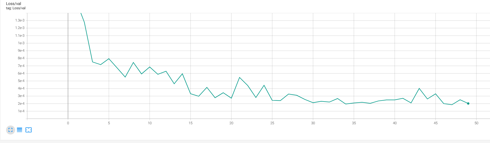

# Deep Learning Cardiac Cine MRI Segmentation

ShanghaiTech BME1312 24 spring project2

**If you think the project is inspirational or interesting, please give it a star.**

## Quick Start
1. Download the dataset
    You can download the dataset from [here](https://drive.google.com/file/d/1tnk_mSQmjR7RgL6pqcGCYh_FGwsCzt8h/view?usp=sharing).

2. Install necessary packages
- torch
- tensorboard (You can use tensorboard to track the training loss and validation loss)
- numpy
- torchvision
- matplotlib

3. Train and test

    To run the code, you should enter the following sentences in the terminal:

```python
python unet.py 
# or
python attention_unet.py
```

4. Notes
In the folder **model**, there are some pre-trained models. You can use them directly. Or you can train the model by yourself.

## Main idea

### Basic Structure

#### 1. model

We use U-Net for the segmentation task and the basic structure of our model is as follows:


What is slightly different from the model above is that the output channel of our model is 3 and the size of the image is $256\times256$.

#### 2. Loss function

We use the cross-entropy loss as our loss function. cross-entropy loss is a widely used loss function in machine learning, particularly in classification problems. It measures the performance of a classification model by comparing the predicted probability distribution with the true probability distribution. Suppose $\hat{y_i}$  is our predicted probability distribution of position $i$ and $y_i$ is the real probability distribution, the cross-entropy loss is calculated by
$J=-\sum\limits_{i=1}^ny_i\log\hat{y}_i+(1-y)\log(1-\hat{y})$

#### 3. Training settings

Our basic training setting is as follows:

| Epochs | Batch size | Learning rate |
| ------ | ---------- | ------------- |
| 50     | 32         | 0.01          |

#### 4. Results
We use the Dice coefficient to evaluate the performance of our model.

The dice coefficient is a measure of the similarity between two probability distributions. It ranges from 0 to 1, where 0 indicates no similarity and 1 indicates perfect similarity.

**The calculation of the Dice coefficient is as follows:  Dice Coefficient = $\frac{2 \times |X \cap Y|}{|X| + |Y|} $**


Following are the Dice coefficients of LV, RV, and MYO for all testing slices
|                        | RV     | MYO    | LV     |
| ---------------------- | ------ | ------ | ------ |
| **Mean**               | 0.9513 | 0.8743 | 0.8923 |
| **Standard deviation** | 0.0114 | 0.0156 | 0.0388 |


Training loss and evaluation loss are as follows:

| Training loss                                             |
| --------------------------------------------------------- |
|  |
| **Evaluation loss**                                       |
|  |

There are some examples of our segmentation results.


  
   


#### 5. Analysis

Here's the analysis and comments based on the provided Dice coefficients for Left Ventricle (LV), Right Ventricle (RV), and Myocardium (MYO):

1. The segmentation performance for the Right Ventricle (RV) is the best, with a mean Dice coefficient of 0.9513 and a lowest standard deviation of 0.0114. This indicates that the segmentation quality for the RV is excellent and highly consistent.
2. The average segmentation performance for the Myocardium (MYO) is the worst of the three, with a mean Dice coefficient of 0.8743, slightly lower than the LV. However, the standard deviation of 0.0156 is significantly lower than the LV, suggesting that the segmentation results for the MYO are more stable and consistent compared to the LV.
3. The average segmentation performance for the Left Ventricle (LV) is the second best among the three structures. The mean Dice coefficient is 0.8923, slightly higher than MYO. Notably, the standard deviation for the LV is as high as 0.0388, which is significantly higher than the MYO and RV, implying that the segmentation results for the LV have a high variability and lack stability and consistency.

These differences in segmentation performance may be attributed to the following factors:

1. Structural complexity: The RV is often bigger, while the LV and MYO are often smaller and have more complex shapes and boundaries, increasing the difficulty of segmentation.
2. Contrast differences: The RV generally has a higher contrast with surrounding tissues, while the contrast between the LV and MYO with adjacent structures may be lower, making segmentation more challenging.

To improve the segmentation performance, we consider some modifications to the U-Net architecture:

### Strategy 1: U-Net without short-cut connection and cross-entropy loss

In this part, we remove the short-cut connection in the U-Net and retrain the abated U-Net following the same procedure of training the original U-Net.

#### 1. Results

Following is the comparison of the segmentation performance (Dice coefficient) of the two networks.

|                        | RV     | MYO    | LV     |
| ------------------------------------------------- | ------------------- | ------------------- | ------------------- |
| **Mean / Std of U-Net**                           | **0.9513** / 0.0114 | **0.8743** / 0.0156 | **0.8923** / 0.0388 |
| **Mean / Std of U-Net w.o. short-cut connection** | **0.9260** / 0.0114 | **0.7733** / 0.0197 | **0.8617** / 0.0225 |

Training loss and evaluation loss of U-Net without short-cut connection are as follows:

| Training loss                                             |
| --------------------------------------------------------- |
|  |
| **Evaluation loss**                                       |
|  |

#### 2. Analysis

1. To sum up, the motivation behind this type of skip connection is that they have an uninterrupted gradient flow from the first layer to the last layer, which tackles the vanishing gradient problem. Concatenative skip connections enable an alternative way to ensure feature reusability of the same dimensionality from the earlier layers and are widely used.

2. On the other hand, long skip connections are used to pass features from the encoder path to the decoder path to recover spatial information lost during downsampling. Short skip connections appear to stabilize gradient updates in deep architectures. Finally, skip connections enable feature reusability and stabilize training and convergence.

### Strategy 2:  U-Net with data argumentation and cross-entropy loss

#### 1. data augmentations

We add several methods of data argumentation as follows:

1. **Random Horizontal Flip**
2. **Random Rotation**

```python
transforms.Compose([
        transforms.RandomHorizontalFlip(), # Randomly flip the image with a probability of 0.5
        transforms.RandomRotation(10) # Randomly rotate the image with an angle of 10 degrees
    ])
```

#### 2. Results

Following is the performance of U-Net without data argumentation and U-Net with data argumentation

|                        | RV     | MYO    | LV     |
| ----------------------------------------------- | ------------------- | ------------------- | ------------------- |
| **Mean / Std of U-Net**                         | **0.9513** / 0.0114 | **0.8743** / 0.0156 | **0.8923** / 0.0388 |
| **Mean / Std of U-Net with data argumentation** | **0.9451** / 0.0091 | **0.8821** / 0.0149 | **0.8533** / 0.1719 |

Training loss and evaluation loss of U-Net with data argumentation are as follows:

| Training loss                                             |
| --------------------------------------------------------- |
|  |
| **Evaluation loss**                                       |
|   |

#### 3. Analysis
We compare the training loss and evaluation loss between the original U-Net, U-Net without data argumentation, and U-Net with data argumentation.

| Training loss                                             |
| --------------------------------------------------------- |
|   |
| **Evaluation loss**                                       |
|   |

We see that the U-Net model with data augmentation has lower evaluation loss but higher training loss compared to the U-Net model without data augmentation. 

1. **Increased Training Loss**
   - **Added Variability**: Random horizontal flips and rotations introduce more variability into the training data. This means the model has to learn to generalize from a more diverse set of examples, which can make the training process harder and lead to higher training loss.
   - **Learning Difficulty**: The transformations can make some training examples more challenging for the model to learn from, increasing the complexity of the learning task. This can result in the model taking longer to converge, leading to a higher training loss during the training phase.
2. **Lower Evaluation Loss**
   - **Better Generalization**: Despite the higher training loss, the augmented data helps the model to generalize better to new, unseen data. This is because the model has been exposed to a wider variety of data patterns and transformations during training. Consequently, when evaluated on the validation or test set (which includes data that has not been transformed in the same way), the model performs better, resulting in a lower evaluation loss.
   - **Robustness to Variations**: The random flips and rotations mimic potential variations in real-world data. By training on these augmented images, the model becomes more robust to such variations, which often occur in real medical images due to differences in acquisition angles, patient positioning, and other factors. This robustness translates to better performance on the evaluation set.
### Strategy 3: U-Net with data argumentation and soft dice loss

We comprehensively consider the average test loss and its standard deviation and the evaluation curve of the training step. We consider the U-Net model with data argumentation as the best model.

|                        | RV     | MYO    | LV     |
| ------------------------------------------------- | ------------------- | ------------------- | ------------------- |
| **Mean / Std of U-Net**                           | **0.9513** / 0.0114 | **0.8743** / 0.0156 | **0.8923** / 0.0388 |
| **Mean / Std of U-Net w.o. short-cut connection** | **0.9260** / 0.0114 | **0.7733** / 0.0197 | **0.8617** / 0.0225 |
| **Mean / Std of U-Net with data argumentation** | **0.9451** / 0.0091 | **0.8821** / 0.0149 | **0.8533** / 0.1719 |

 

In this part, we change the loss function to the soft Dice loss to see if it can improve the performance of the model.

#### 1. Results

In this part, we use another indicator **accuracy** to evaluate the performance of the model. 

The definition of accuracy is: 
$\text{Accuracy} = \frac{\text{TP} + \text{TN}}{\text{TP} + \text{TN} + \text{FP} + \text{FN}}$

Where:

- $\text{TP}$ (True Positives) is the number of pixels correctly identified as positive.
- $\text{TN}$ (True Negatives) is the number of pixels correctly identified as negative.
- $\text{FP}$ (False Positives) is the number of pixels incorrectly identified as positive.
- $\text{FN}$ (False Negatives) is the number of pixels incorrectly identified as negative.

Following is the segmentation accuracy of the two models with cross-entropy loss and soft Dice loss

|                        | RV     | MYO    | LV     |
| ----------------------------------------------- | ------------------- | ------------------- | ------------------- |
| **Mean / Std of U-Net with cross-entropy loss** | **0.9988** / 0.0002 | **0.9973** / 0.0002 | **0.9977** / 0.0004 |
| **Mean / Std of U-Net with soft Dice loss**     | **0.9666** / 0.0021 | **0.9659** / 0.0031 | **0.9652** / 0.0026 |

Training loss and evaluation loss of U-Net with soft Dice loss are as follows:
| Training loss                                             |
| --------------------------------------------------------- |
|   |
| **Evaluation loss**                                       |
|   |

#### 2. Analysis 

1. **Overall Performance**:
   - The U-Net model demonstrates higher segmentation accuracy when trained with cross-entropy loss compared to the soft Dice loss across all three structures (RV, MYO, LV).
   - The mean accuracy for the cross-entropy loss is significantly higher (close to 0.998) compared to the soft Dice loss (around 0.966).
2. **Consistency**:
   - The standard deviation (Std) for the cross-entropy loss is extremely low (0.0002 to 0.0004), indicating very consistent performance across different samples.
   - The standard deviation for the soft Dice loss is slightly higher (0.0021 to 0.0031), suggesting more variability in the segmentation performance.
3. **Implications**:
   - **Cross-Entropy Loss**: This loss function appears to be more effective for this particular segmentation task, producing higher and more consistent accuracy. This might be because cross-entropy loss is well-suited for pixel-wise classification tasks commonly found in segmentation problems. 
   - **Soft Dice Loss**: Although it shows lower accuracy, the soft Dice loss is designed to handle class imbalance by focusing on the overlap between predicted and ground truth regions. This might explain why it has higher variability, as it tries to optimize for different aspects of the segmentation.

### Strategy 4: Attention U-Net
As mentioned in the previous strategies, by comprehensively considering the average test loss and its standard deviation and the evaluation curve of the training step, we regard the U-Net model with data argumentation as the best model.

In this part, we try to introduce the Attention U-Net model to see if the attention mechanism can improve the performance of the model.

Now, our model is Attention U-Net with data argumentation.

the basic structure of our model is as follows:


The model is referenced from the paper [Attention U-Net: Learning Where to Look for the Pancreas](https://arxiv.org/abs/1804.03999)

Compared to the regular U-Net decoder, the Attention U-Net incorporates an attention mechanism that gates the features from the encoder before concatenating them with the decoder features. This attention-gating process enhances the feature maps by including important information from different spatial positions, enabling the model to focus more on specific target regions.
#### 1. Results

We continue to use the indicator **accuracy** to evaluate the performance of the model.

Following are the segmentation accuracy of U-Net with data argumentation, Attention U-Net, and Attention U-Net with data argumentation.

|                        | RV     | MYO    | LV     |
| ----------------------------------------------- | ------------------- | ------------------- | ------------------- |
| **Mean / Std of U-Net with cross-entropy loss** | **0.9988** / 0.0002 | **0.9973** / 0.0002 | **0.9977** / 0.0004 |
| **Mean / Std of Attention U-Net**     | **0.9989** / 0.0004 | **0.9976** / 0.0005 | **0.9984** / 0.0006 |
| **Mean / Std of Attention U-Net with data augmentation**     | **0.9990** / 0.0001 | **0.9974** / 0.0002 | **0.9982** / 0.0004 |

Training loss and evaluation loss  are as follows:                                    
  

#### 2. Analysis 
1. **Overall Performance** :
- The Attention U-Net without data argumentation model demonstrates higher segmentation accuracy compared to Attention U-Net with data argumentation on MYO and LV.

- Introducing the attention mechanism increases the number of parameters, enhances the model's focus on important regions of the image, and improves segmentation accuracy. This leads to higher segmentation accuracy when compared to U-Net with cross-entropy loss across all three structures (RV, MYO, LV). Additionally, it does not significantly increase the inference time.
2. **Consistency**:
- For the Attention U-Net with data augmentation, the consistency on all three structures(RV, MYO, LV) is extremely higher compared to Attention U-Net without data augmentation.
- The consistency of the Attention U-Net with data augmentation is stronger than that of the U-Net with cross-entropy loss on RV and is on par with it on MYO and LV. The improved consistency may be due to the attention mechanism, which focuses on the target region during image segmentation, thereby increasing the model's sensitivity to the target region.


